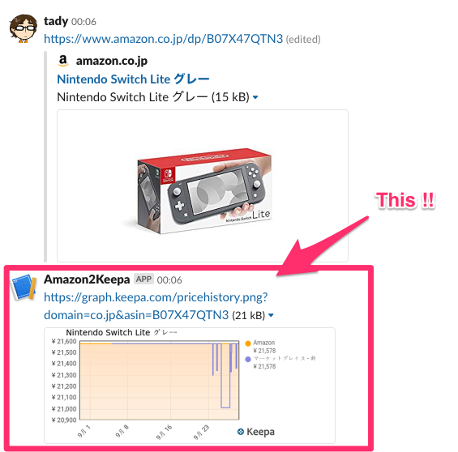

# slack-amazon-keepa
Slack bot that returns Keepa image on posting an Amazon's product URL.

## What's this?

## Environment variables
- SLACK_OAUTH_ACCESS_TOKEN
- SLACK_SIGNED_SECRET

## Slack App configurations

- App Type
  * Event Subscriptions

### OAuth & Permissions

- Scopes
  * `channels:history`
  * `chat:write:bot`

### Event Subscriptions

- Request URL
  * https://{host}/events-endpoint
- Subscribe to Workspace Events
  * `message.channels`

## Notice

Currently, this bot works with products in `amazon.co.jp`.
